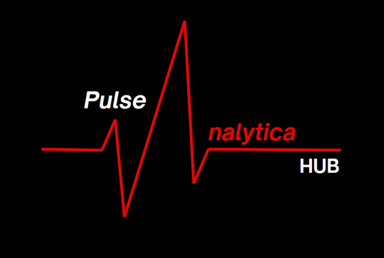

# Reporte de Conflictos Mineros a Marzo 2024

## Descripción del Proyecto

El Reporte de Conflictos Mineros a Marzo 2024 proporciona una visión detallada de la situación de los conflictos sociales en Perú. A través de análisis descriptivos y geográficos, se exploran los principales departamentos afectados, las entidades involucradas y las fases de los conflictos activos. Además, se emplean diversas visualizaciones, como mapas choropleth, mapas de calor y gráficos de barras, para ofrecer una comprensión completa de la distribución geográfica y la intensidad de los conflictos. El uso del modelo de clustering espacial DBSCAN añade una capa adicional de análisis al identificar áreas críticas con alta concentración de conflictos. Este reporte proporciona valiosa información para comprender y abordar los desafíos relacionados con los conflictos mineros en el país.

## Tecnologías Utilizadas

- Python
- Pandas
- NumPy
- Plotly Express
- Streamlit
- Scikit-learn
- Geopy
- Shapely

## Estructura del Proyecto

El proyecto se organiza en varias secciones principales:

- **Análisis Descriptivo:** Explora los principales departamentos con más casos, las entidades involucradas y las fases de los conflictos.
- **Análisis Geográfico:** Utiliza visualizaciones geoespaciales como mapas choropleth, mapas de calor y mapas de puntos para representar la distribución geográfica y la intensidad de los conflictos.
- **Modelo de Clustering Espacial DBSCAN:** Aplica el algoritmo de clustering DBSCAN para identificar áreas críticas con alta concentración de conflictos.

## Uso del Proyecto

Para ejecutar la aplicación, sigue estos pasos:

1. Clona este repositorio en tu máquina local.
2. Asegúrate de tener todas las bibliotecas y dependencias instaladas. Puedes instalarlas utilizando `pip install -r requirements.txt`.
3. Ejecuta la aplicación utilizando `streamlit run app.py` en tu terminal.
4. La aplicación se abrirá en tu navegador web local, donde podrás explorar los diferentes análisis y visualizaciones proporcionadas.

## Acerca del Autor

- **Nombre:** Tato Warthon
- **GitHub:** [warthon-190399](https://github.com/warthon-190399)

## Datos y Metodología

- **Fuente de Datos:** Los datos fueron recopilados mediante técnicas de extracción web automatizada a partir de los reportes de conflictos sociales de la Defensoría del Pueblo que se publican mensualmente.
- **Metodología:** 
    - **Recopilación de Datos:** Los datos se obtuvieron a partir de los reportes mensuales de conflictos sociales publicados por la Defensoría del Pueblo. Se utilizó un proceso de extracción web automatizada para recopilar la información necesaria.
    - **Preprocesamiento de Datos:** Una vez recopilados, los datos fueron sometidos a un proceso de limpieza y preprocesamiento para eliminar datos duplicados, incompletos o inconsistentes, así como para homogeneizar el formato de los datos.
    - **Análisis Descriptivo:** Se realizó un análisis descriptivo de los datos para explorar la distribución y características de los conflictos sociales en Perú. Esto incluyó la identificación de los principales departamentos afectados, las entidades involucradas y las fases de los conflictos.
    - **Análisis Geoespacial:** Se emplearon técnicas de visualización geoespacial para explorar la distribución geográfica de los conflictos sociales. Esto incluyó la creación de mapas choropleth, mapas de calor y mapas de puntos para representar la intensidad y ubicación de los conflictos.
    - **Modelado con DBSCAN:** Se aplicó el algoritmo de clustering espacial DBSCAN para identificar áreas críticas con alta concentración de conflictos. Esto proporcionó información adicional sobre las zonas más afectadas y la distribución espacial de los conflictos.

